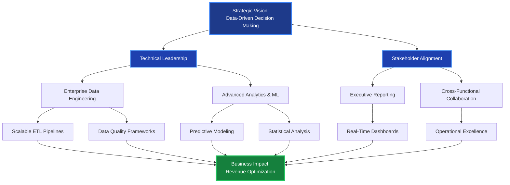
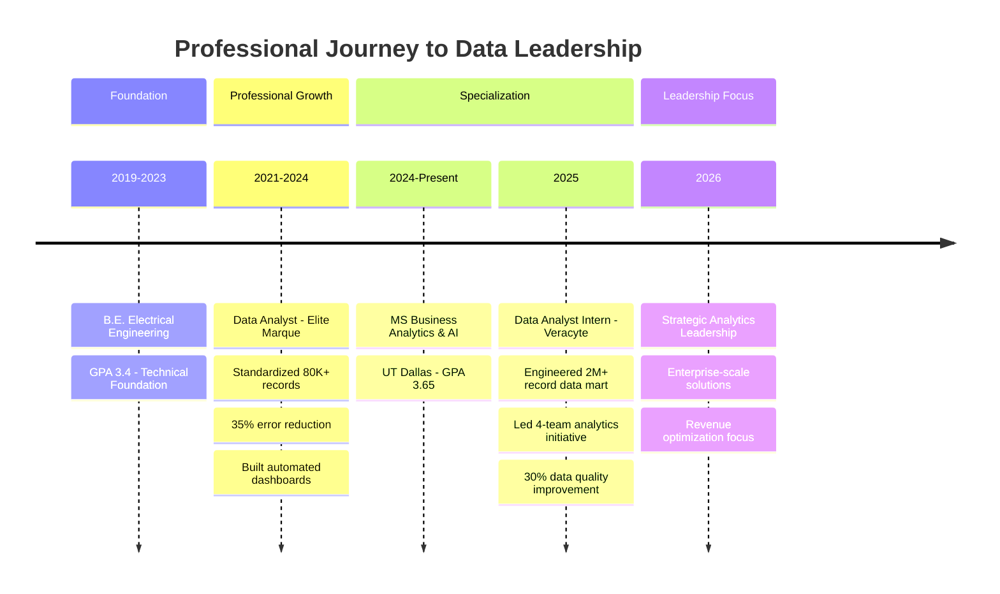

<div align="center">

</div>

<div align="center">
  
### 📊 Transforming Data into Strategic Business Value | MS Business Analytics & AI | 3+ Years Delivering Measurable Impact

[](https://www.linkedin.com/in/pranav-grover-utd/?isSelfProfile=false)
[](mailto:pranavg0520@outlook.com)
[](https://www.google.com/maps/place/Dallas,+TX)

</div>

---

## 🎯 Executive Summary

Results-driven **Data Analytics Professional** with a proven track record of engineering enterprise-scale data solutions that drive strategic decision-making and operational excellence. Currently pursuing **MS in Business Analytics and AI** at UT Dallas (May 2026, GPA: 3.65/4.0), combining 3+ years of hands-on experience with advanced analytical methodologies to deliver measurable business outcomes.

**Core Competencies:** Data Engineering Leadership | Enterprise Dashboard Architecture | Revenue Cycle Optimization | Cross-Functional Stakeholder Management | Strategic Analytics Implementation

<div align="center">

### 📈 Leadership Impact Dashboard

| **Metric** | **Achievement** | **Business Value** |
|:-----------|:----------------|:-------------------|
| **Data Consolidation** | 2M+ records unified across 4 operational teams | Improved KPI accuracy & decision velocity |
| **Process Efficiency** | 20-35% reduction in reporting time | Freed 15+ hours/week for strategic analysis |
| **Data Quality** | 30% elimination of data mismatches | Enhanced reporting accuracy & stakeholder trust |
| **Dashboard Deployment** | 25+ dynamic visualizations across 5 Power BI/Tableau dashboards | Real-time visibility for C-level leadership |
| **Team Enablement** | 4 operational teams supported | Data-driven prioritization & revenue optimization |
| **Data Governance** | 8 automated quality checks implemented | Proactive anomaly detection & risk mitigation |

</div>

---

## 💡 Leadership Philosophy

> "Strategic data leadership is about translating complex analytical insights into actionable business strategies that empower teams, optimize operations, and drive measurable revenue impact. I believe in building scalable data infrastructures that serve as the foundation for informed decision-making across all organizational levels."

My approach combines technical excellence with business acumen—architecting robust data solutions while maintaining clear communication with executive stakeholders. I prioritize data quality, operational efficiency, and cross-functional collaboration to ensure analytics initiatives deliver tangible ROI and support long-term strategic objectives.

---

## 🏗️ Strategic Impact Architecture



---

## 📊 Career Progression Timeline



---

## 🎖️ Key Strategic Achievements

### 💼 Veracyte - Data Analyst Intern (Aug 2025 – Nov 2025)

**Strategic Initiative:** Revenue Cycle Analytics Transformation

- **Enterprise Data Architecture:** Engineered Snowflake-based data mart consolidating **2M+ claims and billing records**, establishing single source of truth for denial management, reimbursement tracking, and turnaround time metrics across **4 operational teams**
  
- **Executive Dashboard Portfolio:** Designed and deployed **5 Power BI and Tableau dashboards** with advanced DAX measures tracking denial rates, payer mix, and aging buckets—**reducing manual reporting time by 20%** and delivering real-time operational visibility to senior leadership

- **Data Quality Leadership:** Architected **SQL validation pipelines** across 3 source systems, **eliminating data mismatches by 30%** and strengthening data integrity for downstream analytics and strategic decision-making

- **Operational Excellence:** Implemented **8 automated quality checks** with real-time anomaly alerting, cutting root cause analysis time and improving payment reporting accuracy across critical billing workflows

- **Strategic Advisory:** Synthesized weekly revenue cycle metrics for operations leadership, enabling data-driven prioritization of payer escalations and claim resubmission strategies

**Business Impact:** Enhanced revenue cycle efficiency, improved cash flow predictability, and empowered leadership with actionable insights for strategic payer negotiations

---

### 🏢 Elite Marque - Data Analyst (Jun 2021 – Jun 2024)

**Strategic Initiative:** Enterprise Data Standardization & Analytics Automation

- **Data Governance Leadership:** Standardized and transformed **80K+ records across 4 business units** using Python and SQL, **reducing reporting errors by 35%** and establishing consistent data quality standards for analytics consumption

- **Analytics Infrastructure:** Architected automated Power BI and Excel dashboards featuring **20+ dynamic visualizations**, **cutting manual reporting effort by 25%** and accelerating trend identification for senior stakeholders

- **Strategic Business Intelligence:** Delivered weekly and monthly performance analyses translating raw operational data into measurable business insights, directly supporting strategic decisions across revenue and operations functions

- **Process Optimization:** Diagnosed and resolved **3 critical data pipeline gaps** impacting downstream reporting accuracy, collaborating with operations teams to remediate upstream data entry issues and prevent future discrepancies

**Business Impact:** Established scalable analytics foundation, improved data-driven decision-making velocity, and created operational efficiencies valued at 15+ hours/week across leadership teams

---

## 🛠️ Executive Technology Stack

<div align="center">

### Data Engineering & Analytics Platforms


### Business Intelligence & Visualization


### Data Infrastructure & Processing


### Advanced Analytics & ML


</div>

---

## 🚀 Featured Strategic Projects

### 🚗 Automobile Price Prediction & Customer Segmentation Engine

**Strategic Objective:** Revenue optimization through predictive analytics and targeted customer segmentation

**Technical Leadership:**
- Engineered ensemble model (Random Forest + Gradient Boosting) processing **800K+ records** with **96% prediction accuracy** to support data-driven pricing strategies and revenue optimization
- Applied K-Means and Hierarchical clustering for customer segmentation, **improving targeting accuracy by 30%** through advanced feature engineering and iterative model tuning
- Translated model outputs into actionable pricing tiers and segment profiles, enabling stakeholders to quantify revenue impact and personalize offerings across customer cohorts

**Business Impact:** Enabled dynamic pricing strategy, improved customer acquisition cost efficiency, and supported strategic market positioning decisions

**Technologies:** Python, SQL, Scikit-learn, Statistical Modeling

---

### 🚛 Az National Trucking - Big Data Fleet Analytics Platform

**Strategic Objective:** Operational safety optimization and cost reduction through big data analytics

**Technical Leadership:**
- Architected big data infrastructure ingesting **8,000+ geolocation records** and 100-driver fleet dataset into HDFS using Cloudera Hadoop (HDP), with Hive tables and Apache Impala queries connected to Tableau via ODBC for large-scale operational analytics
- Built interactive Tableau dashboards analyzing unsafe driving events across 100 drivers and multiple truck models, identifying geographic hotspots and risk scores through behavioral analysis
- Delivered data-driven recommendations for route optimization and driver coaching, translating complex geospatial and behavioral patterns into actionable fleet performance insights

**Business Impact:** Reduced safety incidents, optimized fuel efficiency, and enabled proactive fleet management strategies saving operational costs

**Technologies:** Hadoop, Hive, Impala, Tableau, Big Data Analytics

---

### 📊 Uber Trip Analysis - Power BI Dashboard

**Strategic Objective:** Business intelligence platform for ride-sharing operational metrics

**Technical Leadership:**
- Analyzed comprehensive Uber trip dataset delivering insights into booking trends, customer behavior, revenue generation, and operational efficiency
- Built dynamic Power BI dashboard with KPI cards, measure selectors, and analysis by payment type, trip type, and vehicle type
- Implemented time series analysis with 10-minute interval area charts, day-wise trends, and hourly heatmaps for pattern identification

**Business Impact:** Enabled operational optimization, pricing model refinement, and location-based service improvements

**Technologies:** Power BI, DAX, SQL, Statistical Analysis

---

### 🏥 U.S. Nursing Homes Financial Analysis (2015-2021)

**Strategic Objective:** Healthcare financial performance analysis and COVID-19 impact assessment

**Technical Leadership:**
- Analyzed financial performance, quality indicators, and regulatory penalties across U.S. nursing homes using multiple CMS datasets
- Evaluated COVID-19 impact on net income, staffing, and operational metrics across facilities of different sizes
- Identified **1178% increase in net income** for larger facilities during COVID-19, with comprehensive penalty trend analysis

**Business Impact:** Informed healthcare policy decisions, identified operational efficiency opportunities, and quantified pandemic impact on financial performance

**Technologies:** Python, Pandas, Matplotlib, Seaborn, Statistical Analysis

---

### 🏎️ F1 Data Analysis - SQL & Tableau Platform

**Strategic Objective:** Sports analytics platform for Formula 1 racing insights (1953-2020)

**Technical Leadership:**
- Designed relational database using SQL to efficiently store and manage extensive Formula 1 data including race results, driver statistics, team information, and circuit details
- Crafted SQL queries for driver and team performance metrics, historical trend analysis, and key pattern identification
- Created interactive Tableau dashboards providing user-friendly interface for data exploration and visualization

**Business Impact:** Enhanced fan engagement through data-driven insights and provided comprehensive analytical framework for racing performance analysis

**Technologies:** SQL, Tableau, Database Design, Data Visualization

---

### 📈 Cohort Analysis with Python - Retention Analytics

**Strategic Objective:** Customer retention analysis and lifetime value optimization

**Technical Leadership:**
- Implemented cohort analysis workflows using Python and pandas for tracking user groups over time
- Analyzed purchase behavior, engagement patterns, and retention metrics to understand customer loyalty and product-market fit
- Created visualization heatmaps and retention curves identifying behavioral differences across cohorts

**Business Impact:** Enabled targeted retention strategies, improved customer lifetime value understanding, and informed product development priorities

**Technologies:** Python, Pandas, Jupyter Notebook, Statistical Analysis

---

## 🎓 Academic Excellence & Continuous Learning

<div align="center">

| **Degree** | **Institution** | **Focus** | **GPA** | **Timeline** |
|:-----------|:----------------|:----------|:--------|:-------------|
| **M.S. Business Analytics & AI** | University of Texas at Dallas | Advanced Analytics, Machine Learning, Strategic Decision-Making | **3.65/4.0** | Aug 2024 – May 2026 |
| **B.E. Electrical & Electronics** | Bharati Vidyapeeth's College of Engineering | Technical Foundation, Systems Thinking | **3.4/4.0** | Aug 2019 – May 2023 |

</div>

**Key Coursework:** Advanced Statistical Analysis, Machine Learning for Business, Big Data Analytics, Predictive Modeling, Data Mining, Business Intelligence, Strategic Analytics

---

## 🧠 Technical Expertise Landscape

```mermaid
mindmap
  root((Pranav Grover<br/>Data Analytics Leader))
    Data Engineering
      ETL Pipelines
      Snowflake Architecture
      Data Modeling
      Quality Frameworks
      SQL Optimization
    Business Intelligence
      Power BI Dashboards
      Tableau Visualizations
      DAX Measures
      Executive Reporting
      KPI Design
    Programming & Analytics
      Python Advanced
      R Statistical Analysis
      SQL Expert Level
      Scikit-learn ML
      VBA Automation
    Strategic Analytics
      A/B Testing
      Forecasting Models
      Revenue Optimization
      