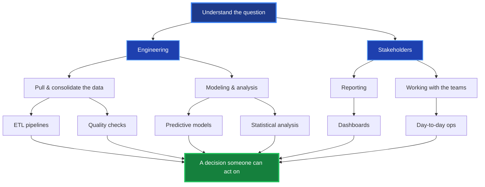
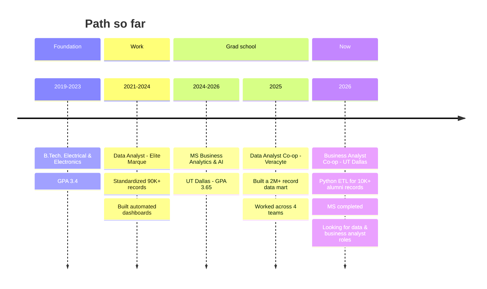
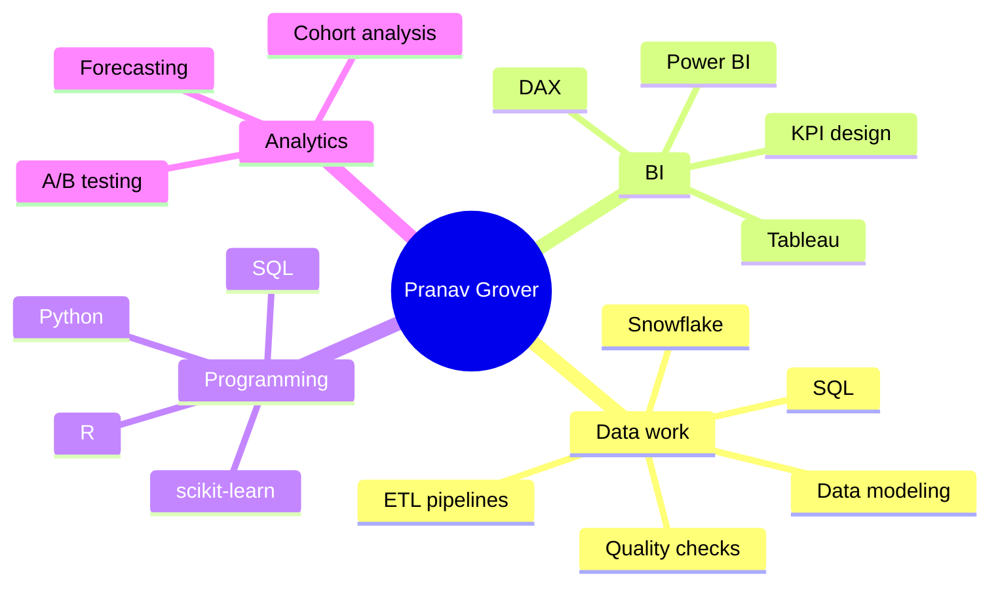

Data & business analyst in San Francisco, CA. SQL, Python, and Power BI/Tableau across operations, marketing, finance, and revenue reporting, mostly on the messy parts, getting data clean, consolidated, and into a dashboard someone will actually use.

---

## About

I just finished my MS in Business Analytics and AI at UT Dallas (graduated May 2026, GPA 3.65). Before grad school I spent about three years as a data analyst at Elite Marque; in fall 2025 I did a co-op at Veracyte on revenue-cycle analytics, and this spring I worked as a business analyst co-op at UT Dallas's Davidson Gundy Alumni Center.

Most of my work falls in the same place: data that lives in too many systems, doesn't agree with itself, and needs to end up in a report leadership can trust. I write a lot of SQL, do the cleanup in Python, and build the dashboards in Power BI and Tableau. I'm currently looking for full-time data and business analyst roles.

---

## How I approach a project

---

## Timeline

---

## Experience

### UT Dallas, Davidson Gundy Alumni Center · Business Analyst Co-op (Jan 2026 – May 2026)

Advancement reporting for the alumni operations team.

- Built Python ETL pipelines to extract, clean, and standardize 10,000+ alumni records from LinkedIn profile exports, improving dataset accuracy by about 30%.
- Found unindexed joins in legacy Microsoft Access databases and rebuilt the query logic, improving query performance by ~40% and speeding up report delivery.

### Veracyte · Data Analyst Co-op (Aug 2025 – Nov 2025)

Worked on revenue-cycle analytics for the billing and claims side.

- Built a Snowflake data mart consolidating 2M+ claims and billing records so denial management, reimbursement, and turnaround-time metrics came from one place instead of four separate team spreadsheets.
- Built 5 Power BI and Tableau dashboards (denial rates, payer mix, aging buckets) with reusable DAX measures that cut manual reporting effort by about 40%.
- Wrote 8 automated SQL validation rules with threshold alerts across 3 source systems, improving data reliability by ~30% so bad data got caught before it hit a report.
- Automated the weekly revenue-cycle summaries by pairing Python with generative AI to turn raw Power BI KPI outputs into narrative leadership briefs, cutting report prep time by ~50%.

### Elite Marque · Data Analyst (Jun 2021 – Jun 2024)

Mostly data standardization and getting reporting off of manual spreadsheets.

- Cleaned and standardized 90K+ customer and sales records across 4 business units in Python and SQL, which dropped reporting errors by about 35%.
- Built Power BI and Excel dashboards (20+ visuals) and automated enough of the reporting to cut the manual effort by roughly 25%.
- Tracked down and fixed 3 pipeline issues that were quietly corrupting downstream reports, and worked with ops to fix the data-entry problems upstream.
- Ran EDA on revenue and churn across the 4 units, flagged pricing and marketing gaps in monthly leadership reviews, and helped drive about 15% revenue growth across client accounts.

---

## Projects

### Automobile price prediction & customer segmentation

Predicting used-car prices and grouping customers for targeted pricing.
- Trained an ensemble (Random Forest + Gradient Boosting) on ~800K records, landing around 96% accuracy.
- Used K-Means and hierarchical clustering for segmentation and turned the output into a handful of pricing tiers.

Python, SQL, scikit-learn.

### Az National Trucking · big data governance pipeline

Centralizing fleet data for a trucking company with no single view across 100+ drivers.
- Loaded 8,000+ GPS records into HDFS on Cloudera Hadoop, queried with Hive and Impala, and connected Tableau over ODBC.
- Built Tableau dashboards for geographic hotspots and per-driver/truck performance, turning that into route recommendations that cut route time by about 12%.

Hadoop, Hive, Impala, Tableau.

### Uber trip analysis · Power BI

A dashboard for ride-sharing trip patterns.
- Analyzed booking trends, revenue, and trip/payment/vehicle types.
- Built KPI cards and measure selectors, plus time-series views (10-minute area charts, day-wise trends, hourly heatmaps).

Power BI, DAX, SQL.

### U.S. nursing homes financial analysis (2015–2021)

Financial performance and COVID-19 impact using CMS data.
- Looked at net income, staffing, and penalties across facilities of different sizes.
- Found that larger facilities saw a 1,178% jump in net income during COVID, alongside the penalty trends.

Python, pandas, matplotlib, seaborn.

### F1 data analysis · SQL & Tableau

Formula 1 race data from 1953–2020.
- Designed a relational schema for race results, drivers, teams, and circuits.
- Wrote queries for driver/team performance and historical trends, and built Tableau dashboards to explore it.

SQL, Tableau.

### Cohort analysis with Python

Retention and lifetime-value analysis.
- Built cohort workflows in pandas to track user groups over time.
- Made retention heatmaps and curves to compare behavior across cohorts.

Python, pandas, Jupyter.

---

## Tech I use

### Data & analytics

### BI & visualization

### Databases & big data

### ML

---

## Education

| Degree | School | GPA | Years |
|:-------|:-------|:----|:------|
| M.S. Business Analytics & AI | University of Texas at Dallas | 3.65/4.0 | 2024 – 2026 |
| B.Tech. Electrical & Electronics | Bharati Vidyapeeth's College of Engineering | 3.4/4.0 | 2019 – 2023 |

Coursework worth mentioning: machine learning for business, big data analytics, predictive modeling, data mining, and BI.

---

## GitHub

---

## At a glance

